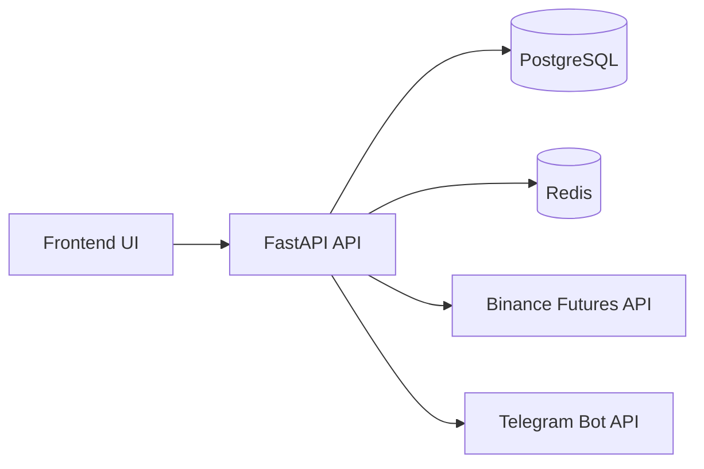

# Architecture Notes

This document captures how the system is assembled, the major components involved, and the rationale behind the current design.

## Codebase Analysis
- **Total Files Analyzed**: 130
- **Total Symbols**: 382
- **Classes**: 63
- **Interfaces**: 18
- **Functions**: 276
- **Types**: 25
- **Enums**: 0
- **Analysis Time**: 643ms

**Languages**:
- .ts: 7 files
- .tsx: 32 files
- .js: 2 files
- .py: 89 files

## System Architecture Overview

The system is a modular service deployed as a Docker Compose stack. A FastAPI backend provides a single API surface, orchestrates trading modules, and persists state to PostgreSQL while caching/streaming via Redis. A React frontend consumes the API for monitoring and control. Requests typically enter via HTTP endpoints, fan into trading modules (scanner, signal generator, risk manager, order executor), and then write results to the database and logs. Operational guardrails (supervisor, manual trade endpoints) allow operators to pause or intervene without redeploying.

## Architectural Layers
### Config
Configuration and constants
- **Directories**: `frontend`, `backend\modules`, `backend\config`, `backend\modules\bot`
- **Symbols**: 5 total, 5 exported
- **Key exports**:
  - [`ConfigManager`](backend\modules\config_manager.py#L14) (class)
  - [`Settings`](backend\config\settings.py#L5) (class)
  - [`get_settings`](backend\config\settings.py#L359) (function)
  - [`reload_settings`](backend\config\settings.py#L363) (function)
  - [`BotConfig`](backend\modules\bot\bot_config.py#L3) (class)

### Services
Business logic and orchestration
- **Directories**: `frontend\src\services`
- **Symbols**: 78 total, 76 exported
- **Key exports**:
  - [`Health`](frontend\src\services\api.ts#L48) (type)
  - [`BotStatus`](frontend\src\services\api.ts#L54) (type)
  - [`DailyStats`](frontend\src\services\api.ts#L64) (type)
  - [`RealizedDailyPoint`](frontend\src\services\api.ts#L98) (type)
  - [`RealizedDailyResponse`](frontend\src\services\api.ts#L106) (type)
  - [`DashboardData`](frontend\src\services\api.ts#L111) (type)
  - [`ConfigResponse`](frontend\src\services\api.ts#L155) (type)
  - [`getHealth`](frontend\src\services\api.ts#L168) (function)
  - [`getVersion`](frontend\src\services\api.ts#L172) (function)
  - [`getBotStatus`](frontend\src\services\api.ts#L178) (function)
  - [`startBot`](frontend\src\services\api.ts#L183) (function)
  - [`stopBot`](frontend\src\services\api.ts#L190) (function)
  - [`updateBotConfig`](frontend\src\services\api.ts#L195) (function)
  - [`getDailyStats`](frontend\src\services\api.ts#L207) (function)
  - [`getRealizedDailyStats`](frontend\src\services\api.ts#L212) (function)
  - [`getPositionsDashboard`](frontend\src\services\api.ts#L218) (function)
  - [`syncPositions`](frontend\src\services\api.ts#L228) (function)
  - [`closePositionExchange`](frontend\src\services\api.ts#L234) (function)
  - [`setPositionStopLoss`](frontend\src\services\api.ts#L239) (function)
  - [`setPositionTakeProfit`](frontend\src\services\api.ts#L244) (function)
  - [`setPositionBreakeven`](frontend\src\services\api.ts#L249) (function)
  - [`setPositionTrailingStop`](frontend\src\services\api.ts#L254) (function)
  - [`cancelOpenOrders`](frontend\src\services\api.ts#L259) (function)
  - [`getConfig`](frontend\src\services\api.ts#L265) (function)
  - [`testTelegram`](frontend\src\services\api.ts#L271) (function)
  - [`getSignals`](frontend\src\services\api.ts#L277) (function)
  - [`backtestQuick`](frontend\src\services\api.ts#L283) (function)
  - [`backtestRun`](frontend\src\services\api.ts#L288) (function)
  - [`getComposeStatus`](frontend\src\services\api.ts#L299) (function)
  - [`getLogs`](frontend\src\services\api.ts#L304) (function)
  - [`SupervisorStatus`](frontend\src\services\api.ts#L310) (type)
  - [`getSupervisorStatus`](frontend\src\services\api.ts#L318) (function)
  - [`supervisorEnable`](frontend\src\services\api.ts#L323) (function)
  - [`supervisorDisable`](frontend\src\services\api.ts#L328) (function)
  - [`supervisorToggle`](frontend\src\services\api.ts#L333) (function)
  - [`SupervisorHealth`](frontend\src\services\api.ts#L338) (type)
  - [`getSupervisorHealth`](frontend\src\services\api.ts#L348) (function)
  - [`BotMetrics`](frontend\src\services\api.ts#L354) (type)
  - [`ExecutionMetrics`](frontend\src\services\api.ts#L397) (type)
  - [`MonitoringMetrics`](frontend\src\services\api.ts#L422) (type)
  - [`RiskMetrics`](frontend\src\services\api.ts#L444) (type)
  - [`getBotMetrics`](frontend\src\services\api.ts#L465) (function)
  - [`getExecutionMetrics`](frontend\src\services\api.ts#L470) (function)
  - [`getMonitoringMetrics`](frontend\src\services\api.ts#L475) (function)
  - [`getRiskMetrics`](frontend\src\services\api.ts#L480) (function)
  - [`PnlBySymbol`](frontend\src\services\api.ts#L485) (type)
  - [`getPnlBySymbol`](frontend\src\services\api.ts#L492) (function)
  - [`MarketTicker`](frontend\src\services\api.ts#L497) (type)
  - [`MarketTickersResponse`](frontend\src\services\api.ts#L504) (type)
  - [`getMarketTickers`](frontend\src\services\api.ts#L509) (function)
  - [`FearGreedPoint`](frontend\src\services\api.ts#L514) (type)
  - [`FearGreedResponse`](frontend\src\services\api.ts#L520) (type)
  - [`getFearGreed`](frontend\src\services\api.ts#L526) (function)
  - [`HistoryAnalysis`](frontend\src\services\api.ts#L531) (interface)
  - [`getHistoryAnalysis`](frontend\src\services\api.ts#L547) (function)
  - [`SniperTrade`](frontend\src\services\api.ts#L553) (interface)
  - [`SniperStats`](frontend\src\services\api.ts#L568) (interface)
  - [`getSniperTrades`](frontend\src\services\api.ts#L575) (function)
  - [`CumulativePnlPoint`](frontend\src\services\api.ts#L585) (interface)
  - [`CumulativePnlResponse`](frontend\src\services\api.ts#L594) (interface)
  - [`getCumulativePnl`](frontend\src\services\api.ts#L598) (function)
  - [`ErrorLog`](frontend\src\services\api.ts#L604) (interface)
  - [`ErrorsResponse`](frontend\src\services\api.ts#L612) (interface)
  - [`getRecentErrors`](frontend\src\services\api.ts#L619) (function)
  - [`ErrorRateResponse`](frontend\src\services\api.ts#L627) (interface)
  - [`getErrorRate`](frontend\src\services\api.ts#L633) (function)
  - [`ErrorSummary`](frontend\src\services\api.ts#L640) (interface)
  - [`getErrorSummary`](frontend\src\services\api.ts#L646) (function)
  - [`LatencyStats`](frontend\src\services\api.ts#L652) (interface)
  - [`getLatencyStats`](frontend\src\services\api.ts#L664) (function)
  - [`SyncStatus`](frontend\src\services\api.ts#L670) (interface)
  - [`getSyncStatus`](frontend\src\services\api.ts#L687) (function)
  - [`MarketConditions`](frontend\src\services\api.ts#L693) (interface)
  - [`getMarketConditions`](frontend\src\services\api.ts#L713) (function)
  - [`toMinutes`](frontend\src\services\api.ts#L719) (function)
  - [`toSeconds`](frontend\src\services\api.ts#L723) (function)

### Utils
Shared utilities and helpers
- **Directories**: `frontend\src\lib`, `backend\utils`
- **Symbols**: 11 total, 11 exported
- **Key exports**:
  - [`cn`](frontend\src\lib\utils.ts#L4) (function)
  - [`TelegramNotifier`](backend\utils\telegram_notifier.py#L10) (class)
  - [`RedisClient`](backend\utils\redis_client.py#L7) (class)
  - [`JSONFormatter`](backend\utils\logger.py#L13) (class)
  - [`RedisLogHandler`](backend\utils\logger.py#L28) (class)
  - [`setup_logger`](backend\utils\logger.py#L78) (function)
  - [`round_step_size`](backend\utils\helpers.py#L3) (function)
  - [`format_quantity`](backend\utils\helpers.py#L13) (function)
  - [`DataValidationError`](backend\utils\binance_client.py#L20) (class)
  - [`DataValidator`](backend\utils\binance_client.py#L28) (class)
  - [`BinanceClientManager`](backend\utils\binance_client.py#L290) (class)

### Components
UI components and views
- **Directories**: `frontend\src\pages`, `frontend\src\components`, `frontend\src\components\ui`
- **Symbols**: 18 total, 3 exported -> depends on: Services
- **Key exports**:
  - [`InputProps`](frontend\src\components\ui\input.tsx#L4) (interface)
  - [`ButtonProps`](frontend\src\components\ui\button.tsx#L26) (interface)
  - [`BadgeProps`](frontend\src\components\ui\badge.tsx#L19) (interface)

### Repositories
Data access and persistence
- **Directories**: `backend`, `backend\tests`, `backend\scripts`, `backend\modules`
- **Symbols**: 17 total, 17 exported
- **Key exports**:
  - [`migrate`](backend\migrate_database.py#L21) (function)
  - [`mock_redis`](backend\tests\test_risk_manager_persistence.py#L8) (function)
  - [`mock_settings`](backend\tests\test_risk_manager_persistence.py#L14) (function)
  - [`risk_manager`](backend\tests\test_risk_manager_persistence.py#L29) (function)
  - [`test_rollover_daily_initialization`](backend\tests\test_risk_manager_persistence.py#L39) (function)
  - [`test_rollover_daily_recovery`](backend\tests\test_risk_manager_persistence.py#L55) (function)
  - [`test_update_intraday_extrema_persistence`](backend\tests\test_risk_manager_persistence.py#L72) (function)
  - [`test_hard_stop_with_recovered_peak`](backend\tests\test_risk_manager_persistence.py#L94) (function)
  - [`print_separator`](backend\scripts\migrate_to_database_config.py#L37) (function)
  - [`check_prerequisites`](backend\scripts\migrate_to_database_config.py#L42) (function)
  - [`show_current_status`](backend\scripts\migrate_to_database_config.py#L79) (function)
  - [`confirm_migration`](backend\scripts\migrate_to_database_config.py#L112) (function)
  - [`migrate_configurations`](backend\scripts\migrate_to_database_config.py#L144) (function)
  - [`show_post_migration_instructions`](backend\scripts\migrate_to_database_config.py#L208) (function)
  - [`main`](backend\scripts\migrate_to_database_config.py#L240) (function)
  - [`Configuration`](backend\modules\config_database.py#L12) (class)
  - [`ConfigurationHistory`](backend\modules\config_database.py#L42) (class)

### Controllers
Request handling and routing
- **Directories**: `backend\utils`, `backend\tests`, `backend\api`, `backend\api\routes`, `backend\api\models`
- **Symbols**: 140 total, 133 exported
- **Key exports**:
  - [`cmd_status`](backend\utils\telegram_bot_handler.py#L10) (function)
  - [`cmd_portfolio`](backend\utils\telegram_bot_handler.py#L42) (function)
  - [`start_telegram_bot`](backend\utils\telegram_bot_handler.py#L66) (function)
  - [`test_supervisor_status`](backend\tests\test_system_routes.py#L7) (function)
  - [`test_logs_endpoint_handles_missing_component`](backend\tests\test_system_routes.py#L21) (function)
  - [`ConnectionManager`](backend\api\websocket.py#L13) (class)
  - [`websocket_endpoint`](backend\api\websocket.py#L51) (function)
  - [`redis_event_listener`](backend\api\websocket.py#L78) (function)
  - [`BacktestRequest`](backend\api\backtesting.py#L15) (class)
  - [`BacktestResponse`](backend\api\backtesting.py#L24) (class)
  - [`run_backtest`](backend\api\backtesting.py#L32) (function)
  - [`quick_backtest`](backend\api\backtesting.py#L116) (function)
  - [`last_month_backtest`](backend\api\backtesting.py#L161) (function)
  - [`get_backtest_templates`](backend\api\backtesting.py#L199) (function)
  - [`ApiKeyMiddleware`](backend\api\app.py#L34) (class)
  - [`lifespan`](backend\api\app.py#L52) (function)
  - [`root`](backend\api\app.py#L285) (function)
  - [`health`](backend\api\app.py#L311) (function)
  - [`version`](backend\api\app.py#L377) (function)
  - [`ExecuteTradeRequest`](backend\api\routes\trading.py#L78) (class)
  - [`execute_trade`](backend\api\routes\trading.py#L85) (function)
  - [`execute_batch_trades`](backend\api\routes\trading.py#L125) (function)
  - [`get_open_positions`](backend\api\routes\trading.py#L177) (function)
  - [`start_position_monitoring`](backend\api\routes\trading.py#L194) (function)
  - [`stop_position_monitoring`](backend\api\routes\trading.py#L205) (function)
  - [`get_monitoring_status`](backend\api\routes\trading.py#L216) (function)
  - [`start_autonomous_bot`](backend\api\routes\trading.py#L226) (function)
  - [`stop_autonomous_bot`](backend\api\routes\trading.py#L273) (function)
  - [`get_bot_status`](backend\api\routes\trading.py#L299) (function)
  - [`get_bot_metrics`](backend\api\routes\trading.py#L314) (function)
  - [`get_execution_metrics`](backend\api\routes\trading.py#L325) (function)
  - [`get_pnl_by_symbol`](backend\api\routes\trading.py#L336) (function)
  - [`get_monitoring_metrics`](backend\api\routes\trading.py#L370) (function)
  - [`get_history_analysis`](backend\api\routes\trading.py#L380) (function)
  - [`get_risk_metrics`](backend\api\routes\trading.py#L389) (function)
  - [`get_execution_config`](backend\api\routes\trading.py#L403) (function)
  - [`update_execution_config`](backend\api\routes\trading.py#L428) (function)
  - [`leverage_preview`](backend\api\routes\trading.py#L492) (function)
  - [`update_bot_config`](backend\api\routes\trading.py#L512) (function)
  - [`test_telegram`](backend\api\routes\trading.py#L547) (function)
  - [`close_position_manual`](backend\api\routes\trading.py#L559) (function)
  - [`close_all_positions`](backend\api\routes\trading.py#L641) (function)
  - [`get_daily_stats`](backend\api\routes\trading.py#L728) (function)
  - [`get_cumulative_pnl`](backend\api\routes\trading.py#L893) (function)
  - [`close_position_exchange`](backend\api\routes\trading.py#L979) (function)
  - [`set_position_stop_loss`](backend\api\routes\trading.py#L1031) (function)
  - [`set_position_take_profit`](backend\api\routes\trading.py#L1067) (function)
  - [`set_position_breakeven`](backend\api\routes\trading.py#L1103) (function)
  - [`set_position_trailing_stop`](backend\api\routes\trading.py#L1151) (function)
  - [`get_realized_daily`](backend\api\routes\trading.py#L1183) (function)
  - [`send_daily_report_manual`](backend\api\routes\trading.py#L1249) (function)
  - [`force_open_many`](backend\api\routes\trading.py#L1262) (function)
  - [`force_open_many_async`](backend\api\routes\trading.py#L1485) (function)
  - [`positions_add_strategic`](backend\api\routes\trading.py#L1502) (function)
  - [`positions_add_strategic_async`](backend\api\routes\trading.py#L1514) (function)
  - [`execute_sniper`](backend\api\routes\trading.py#L1526) (function)
  - [`ManualTradeRequest`](backend\api\routes\trading.py#L1689) (class)
  - [`execute_manual_trade`](backend\api\routes\trading.py#L1699) (function)
  - [`get_trade_history`](backend\api\routes\trading.py#L1789) (function)
  - [`get_sniper_trades`](backend\api\routes\trading.py#L1818) (function)
  - [`get_logs`](backend\api\routes\system.py#L56) (function)
  - [`compose_status`](backend\api\routes\system.py#L79) (function)
  - [`supervisor_status`](backend\api\routes\system.py#L120) (function)
  - [`supervisor_health`](backend\api\routes\system.py#L148) (function)
  - [`supervisor_enable`](backend\api\routes\system.py#L155) (function)
  - [`supervisor_disable`](backend\api\routes\system.py#L165) (function)
  - [`supervisor_toggle`](backend\api\routes\system.py#L175) (function)
  - [`userstream_status`](backend\api\routes\system.py#L190) (function)
  - [`userstream_start`](backend\api\routes\system.py#L199) (function)
  - [`userstream_stop`](backend\api\routes\system.py#L218) (function)
  - [`get_recent_errors`](backend\api\routes\system.py#L231) (function)
  - [`get_error_rate`](backend\api\routes\system.py#L261) (function)
  - [`get_error_summary`](backend\api\routes\system.py#L284) (function)
  - [`get_latency_stats`](backend\api\routes\system.py#L299) (function)
  - [`get_market_conditions`](backend\api\routes\system.py#L342) (function)
  - [`get_metrics_dashboard`](backend\api\routes\system.py#L360) (function)
  - [`get_latency_dashboard`](backend\api\routes\system.py#L382) (function)
  - [`get_trade_dashboard`](backend\api\routes\system.py#L397) (function)
  - [`get_resource_dashboard`](backend\api\routes\system.py#L412) (function)
  - [`TradingRuleCreate`](backend\api\routes\rules.py#L23) (class)
  - [`TradingRuleUpdate`](backend\api\routes\rules.py#L47) (class)
  - [`TradingRuleResponse`](backend\api\routes\rules.py#L57) (class)
  - [`RuleTypeSchema`](backend\api\routes\rules.py#L74) (class)
  - [`list_rules`](backend\api\routes\rules.py#L87) (function)
  - [`create_rule`](backend\api\routes\rules.py#L121) (function)
  - [`get_rule`](backend\api\routes\rules.py#L174) (function)
  - [`update_rule`](backend\api\routes\rules.py#L195) (function)
  - [`delete_rule`](backend\api\routes\rules.py#L252) (function)
  - [`toggle_rule`](backend\api\routes\rules.py#L287) (function)
  - [`get_rule_type_schemas`](backend\api\routes\rules.py#L322) (function)
  - [`get_positions`](backend\api\routes\positions.py#L14) (function)
  - [`get_trades`](backend\api\routes\positions.py#L20) (function)
  - [`get_open_trades`](backend\api\routes\positions.py#L26) (function)
  - [`get_closed_trades`](backend\api\routes\positions.py#L32) (function)
  - [`get_dashboard`](backend\api\routes\positions.py#L38) (function)
  - [`get_positions_margins`](backend\api\routes\positions.py#L194) (function)
  - [`reconcile_positions`](backend\api\routes\positions.py#L243) (function)
  - [`get_sync_status`](backend\api\routes\positions.py#L343) (function)
  - [`sync_positions`](backend\api\routes\positions.py#L417) (function)
  - [`get_open_orders`](backend\api\routes\positions.py#L449) (function)
  - [`cancel_all_open_orders`](backend\api\routes\positions.py#L478) (function)
  - [`diagnostics_exchange`](backend\api\routes\positions.py#L513) (function)
  - [`get_balance`](backend\api\routes\market.py#L22) (function)
  - [`get_price`](backend\api\routes\market.py#L29) (function)
  - [`scan_market`](backend\api\routes\market.py#L36) (function)
  - [`analyze_symbol`](backend\api\routes\market.py#L48) (function)
  - [`get_signals`](backend\api\routes\market.py#L57) (function)
  - [`generate_signal`](backend\api\routes\market.py#L96) (function)
  - [`get_derivatives`](backend\api\routes\market.py#L118) (function)
  - [`get_top_100`](backend\api\routes\market.py#L140) (function)
  - [`get_tickers`](backend\api\routes\market.py#L147) (function)
  - [`get_fear_greed`](backend\api\routes\market.py#L194) (function)
  - [`get_klines`](backend\api\routes\market.py#L241) (function)
  - [`get_db`](backend\api\routes\database_config.py#L19) (function)
  - [`ConfigValue`](backend\api\routes\database_config.py#L28) (class)
  - [`ConfigUpdateResponse`](backend\api\routes\database_config.py#L35) (class)
  - [`BatchUpdateResponse`](backend\api\routes\database_config.py#L44) (class)
  - [`config_health_check`](backend\api\routes\database_config.py#L52) (function)
  - [`get_all_configs`](backend\api\routes\database_config.py#L92) (function)
  - [`get_config_categories`](backend\api\routes\database_config.py#L120) (function)
  - [`get_configs_by_category`](backend\api\routes\database_config.py#L147) (function)
  - [`get_config`](backend\api\routes\database_config.py#L176) (function)
  - [`update_config`](backend\api\routes\database_config.py#L202) (function)
  - [`reload_from_env`](backend\api\routes\database_config.py#L254) (function)
  - [`reset_config`](backend\api\routes\database_config.py#L287) (function)
  - [`get_config_history`](backend\api\routes\database_config.py#L328) (function)
  - [`batch_update_configs`](backend\api\routes\database_config.py#L356) (function)
  - [`invalidate_cache`](backend\api\routes\database_config.py#L406) (function)
  - [`ConfigUpdate`](backend\api\routes\config.py#L11) (class)
  - [`get_config`](backend\api\routes\config.py#L21) (function)
  - [`update_config`](backend\api\routes\config.py#L35) (function)
  - [`TradingRule`](backend\api\models\trading_rules.py#L22) (class)
  - [`Trade`](backend\api\models\trades.py#L21) (class)

### Generators
Content and object generation
- **Directories**: `backend\modules`
- **Symbols**: 1 total, 1 exported
- **Key exports**:
  - [`SignalGenerator`](backend\modules\signal_generator.py#L30) (class)

### Models
Data structures and domain objects
- **Directories**: `backend\models`
- **Symbols**: 1 total, 1 exported
- **Key exports**:
  - [`get_db`](backend\models\database.py#L12) (function)

## Detected Design Patterns
| Pattern | Confidence | Locations | Description |
|---------|------------|-----------|-------------|
| Service Layer | 85% | `WebSocketService` ([websocket.ts](frontend\src\services\websocket.ts)) | Encapsulates business logic in service classes |
| Observer | 75% | `RedisLogHandler` ([logger.py](backend\utils\logger.py)) | Defines a subscription mechanism to notify multiple objects |

## Entry Points
- [`frontend\src\main.tsx`](frontend\src\main.tsx)

## Public API
| Symbol | Type | Location |
| --- | --- | --- |
| [`analyze_symbol`](backend\api\routes\market.py#L48) | function | backend\api\routes\market.py:48 |
| [`api_health`](backend\scripts\supervisor.py#L215) | function | backend\scripts\supervisor.py:215 |
| [`ApiKeyMiddleware`](backend\api\app.py#L34) | class | backend\api\app.py:34 |
| [`App`](frontend\src\App.tsx#L12) | function | frontend\src\App.tsx:12 |
| [`AutonomousBot`](backend\modules\autonomous_bot.py#L41) | class | backend\modules\autonomous_bot.py:41 |
| [`Backtester`](backend\modules\backtester.py#L16) | class | backend\modules\backtester.py:16 |
| [`backtestQuick`](frontend\src\services\api.ts#L283) | function | frontend\src\services\api.ts:283 |
| [`BacktestRequest`](backend\api\backtesting.py#L15) | class | backend\api\backtesting.py:15 |
| [`BacktestResponse`](backend\api\backtesting.py#L24) | class | backend\api\backtesting.py:24 |
| [`backtestRun`](frontend\src\services\api.ts#L288) | function | frontend\src\services\api.ts:288 |
| [`BadgeProps`](frontend\src\components\ui\badge.tsx#L19) | interface | frontend\src\components\ui\badge.tsx:19 |
| [`batch_update_configs`](backend\api\routes\database_config.py#L356) | function | backend\api\routes\database_config.py:356 |
| [`BatchUpdateResponse`](backend\api\routes\database_config.py#L44) | class | backend\api\routes\database_config.py:44 |
| [`BinanceClientManager`](backend\utils\binance_client.py#L290) | class | backend\utils\binance_client.py:290 |
| [`bot_start`](backend\scripts\supervisor.py#L253) | function | backend\scripts\supervisor.py:253 |
| [`bot_status`](backend\scripts\supervisor.py#L271) | function | backend\scripts\supervisor.py:271 |
| [`bot_stop`](backend\scripts\supervisor.py#L262) | function | backend\scripts\supervisor.py:262 |
| [`BotActions`](backend\modules\bot\actions.py#L12) | class | backend\modules\bot\actions.py:12 |
| [`BotConfig`](backend\modules\bot\bot_config.py#L3) | class | backend\modules\bot\bot_config.py:3 |
| [`BotIndicator`](frontend\src\hooks\useBotStatus.ts#L4) | type | frontend\src\hooks\useBotStatus.ts:4 |
| [`BotLoops`](backend\modules\bot\loops.py#L10) | class | backend\modules\bot\loops.py:10 |
| [`BotMetrics`](frontend\src\services\api.ts#L354) | type | frontend\src\services\api.ts:354 |
| [`BotStatus`](frontend\src\services\api.ts#L54) | type | frontend\src\services\api.ts:54 |
| [`BotStrategies`](backend\modules\bot\strategies.py#L11) | class | backend\modules\bot\strategies.py:11 |
| [`ButtonProps`](frontend\src\components\ui\button.tsx#L26) | interface | frontend\src\components\ui\button.tsx:26 |
| [`cancel_all_open_orders`](backend\api\routes\positions.py#L478) | function | backend\api\routes\positions.py:478 |
| [`cancelOpenOrders`](frontend\src\services\api.ts#L259) | function | frontend\src\services\api.ts:259 |
| [`check_order_types`](backend\debug_order_types.py#L10) | function | backend\debug_order_types.py:10 |
| [`check_orders`](backend\scripts\check_orders.py#L14) | function | backend\scripts\check_orders.py:14 |
| [`check_prerequisites`](backend\scripts\migrate_to_database_config.py#L42) | function | backend\scripts\migrate_to_database_config.py:42 |
| [`close_all_positions`](backend\api\routes\trading.py#L641) | function | backend\api\routes\trading.py:641 |
| [`close_position_exchange`](backend\api\routes\trading.py#L979) | function | backend\api\routes\trading.py:979 |
| [`close_position_manual`](backend\api\routes\trading.py#L559) | function | backend\api\routes\trading.py:559 |
| [`closePositionExchange`](frontend\src\services\api.ts#L234) | function | frontend\src\services\api.ts:234 |
| [`cmd_portfolio`](backend\utils\telegram_bot_handler.py#L42) | function | backend\utils\telegram_bot_handler.py:42 |
| [`cmd_status`](backend\utils\telegram_bot_handler.py#L10) | function | backend\utils\telegram_bot_handler.py:10 |
| [`CmdResult`](backend\scripts\supervisor.py#L84) | class | backend\scripts\supervisor.py:84 |
| [`cn`](frontend\src\lib\utils.ts#L4) | function | frontend\src\lib\utils.ts:4 |
| [`compose_build`](backend\scripts\supervisor.py#L174) | function | backend\scripts\supervisor.py:174 |
| [`compose_down`](backend\scripts\supervisor.py#L199) | function | backend\scripts\supervisor.py:199 |
| [`compose_restart`](backend\scripts\supervisor.py#L188) | function | backend\scripts\supervisor.py:188 |
| [`compose_status`](backend\api\routes\system.py#L79) | function | backend\api\routes\system.py:79 |
| [`compose_up_detached`](backend\scripts\supervisor.py#L181) | function | backend\scripts\supervisor.py:181 |
| [`config_health_check`](backend\api\routes\database_config.py#L52) | function | backend\api\routes\database_config.py:52 |
| [`ConfigManager`](backend\modules\config_manager.py#L14) | class | backend\modules\config_manager.py:14 |
| [`ConfigResponse`](frontend\src\services\api.ts#L155) | type | frontend\src\services\api.ts:155 |
| [`ConfigUpdate`](backend\api\routes\config.py#L11) | class | backend\api\routes\config.py:11 |
| [`ConfigUpdateResponse`](backend\api\routes\database_config.py#L35) | class | backend\api\routes\database_config.py:35 |
| [`Configuration`](backend\modules\config_database.py#L12) | class | backend\modules\config_database.py:12 |
| [`ConfigurationHistory`](backend\modules\config_database.py#L42) | class | backend\modules\config_database.py:42 |
| [`ConfigValue`](backend\api\routes\database_config.py#L28) | class | backend\api\routes\database_config.py:28 |
| [`confirm_migration`](backend\scripts\migrate_to_database_config.py#L112) | function | backend\scripts\migrate_to_database_config.py:112 |
| [`ConnectionManager`](backend\api\websocket.py#L13) | class | backend\api\websocket.py:13 |
| [`CorrelationFilter`](backend\modules\correlation_filter.py#L17) | class | backend\modules\correlation_filter.py:17 |
| [`create_rule`](backend\api\routes\rules.py#L121) | function | backend\api\routes\rules.py:121 |
| [`CumulativePnlPoint`](frontend\src\services\api.ts#L585) | interface | frontend\src\services\api.ts:585 |
| [`CumulativePnlResponse`](frontend\src\services\api.ts#L594) | interface | frontend\src\services\api.ts:594 |
| [`DailyReport`](backend\modules\daily_report.py#L12) | class | backend\modules\daily_report.py:12 |
| [`DailyStats`](frontend\src\services\api.ts#L64) | type | frontend\src\services\api.ts:64 |
| [`DashboardData`](frontend\src\services\api.ts#L111) | type | frontend\src\services\api.ts:111 |
| [`DataValidationError`](backend\utils\binance_client.py#L20) | class | backend\utils\binance_client.py:20 |
| [`DataValidator`](backend\utils\binance_client.py#L28) | class | backend\utils\binance_client.py:28 |
| [`delete_rule`](backend\api\routes\rules.py#L252) | function | backend\api\routes\rules.py:252 |
| [`diagnostics_exchange`](backend\api\routes\positions.py#L513) | function | backend\api\routes\positions.py:513 |
| [`docker_compose`](backend\scripts\supervisor.py#L166) | function | backend\scripts\supervisor.py:166 |
| [`docker_logs`](backend\scripts\supervisor.py#L210) | function | backend\scripts\supervisor.py:210 |
| [`docker_ps`](backend\scripts\supervisor.py#L206) | function | backend\scripts\supervisor.py:206 |
| [`ensure_stack_running`](backend\scripts\supervisor.py#L376) | function | backend\scripts\supervisor.py:376 |
| [`ensure_venv`](backend\scripts\supervisor.py#L136) | function | backend\scripts\supervisor.py:136 |
| [`ErrorAggregator`](backend\modules\error_aggregator.py#L18) | class | backend\modules\error_aggregator.py:18 |
| [`ErrorLog`](frontend\src\services\api.ts#L604) | interface | frontend\src\services\api.ts:604 |
| [`ErrorRateResponse`](frontend\src\services\api.ts#L627) | interface | frontend\src\services\api.ts:627 |
| [`ErrorsResponse`](frontend\src\services\api.ts#L612) | interface | frontend\src\services\api.ts:612 |
| [`ErrorSummary`](frontend\src\services\api.ts#L640) | interface | frontend\src\services\api.ts:640 |
| [`execute_batch_trades`](backend\api\routes\trading.py#L125) | function | backend\api\routes\trading.py:125 |
| [`execute_manual_trade`](backend\api\routes\trading.py#L1699) | function | backend\api\routes\trading.py:1699 |
| [`execute_sniper`](backend\api\routes\trading.py#L1526) | function | backend\api\routes\trading.py:1526 |
| [`execute_trade`](backend\api\routes\trading.py#L85) | function | backend\api\routes\trading.py:85 |
| [`ExecuteTradeRequest`](backend\api\routes\trading.py#L78) | class | backend\api\routes\trading.py:78 |
| [`ExecutionMetrics`](frontend\src\services\api.ts#L397) | type | frontend\src\services\api.ts:397 |
| [`FearGreedPoint`](frontend\src\services\api.ts#L514) | type | frontend\src\services\api.ts:514 |
| [`FearGreedResponse`](frontend\src\services\api.ts#L520) | type | frontend\src\services\api.ts:520 |
| [`fix_orders`](backend\scripts\fix_orders.py#L22) | function | backend\scripts\fix_orders.py:22 |
| [`force_open_many`](backend\api\routes\trading.py#L1262) | function | backend\api\routes\trading.py:1262 |
| [`force_open_many_async`](backend\api\routes\trading.py#L1485) | function | backend\api\routes\trading.py:1485 |
| [`format_quantity`](backend\utils\helpers.py#L13) | function | backend\utils\helpers.py:13 |
| [`generate_signal`](backend\api\routes\market.py#L96) | function | backend\api\routes\market.py:96 |
| [`get_all_configs`](backend\api\routes\database_config.py#L92) | function | backend\api\routes\database_config.py:92 |
| [`get_backtest_templates`](backend\api\backtesting.py#L199) | function | backend\api\backtesting.py:199 |
| [`get_balance`](backend\api\routes\market.py#L22) | function | backend\api\routes\market.py:22 |
| [`get_bot_metrics`](backend\api\routes\trading.py#L314) | function | backend\api\routes\trading.py:314 |
| [`get_bot_status`](backend\api\routes\trading.py#L299) | function | backend\api\routes\trading.py:299 |
| [`get_closed_trades`](backend\api\routes\positions.py#L32) | function | backend\api\routes\positions.py:32 |
| [`get_config`](backend\api\routes\database_config.py#L176) | function | backend\api\routes\database_config.py:176 |
| [`get_config`](backend\api\routes\config.py#L21) | function | backend\api\routes\config.py:21 |
| [`get_config_categories`](backend\api\routes\database_config.py#L120) | function | backend\api\routes\database_config.py:120 |
| [`get_config_history`](backend\api\routes\database_config.py#L328) | function | backend\api\routes\database_config.py:328 |
| [`get_configs_by_category`](backend\api\routes\database_config.py#L147) | function | backend\api\routes\database_config.py:147 |
| [`get_cumulative_pnl`](backend\api\routes\trading.py#L893) | function | backend\api\routes\trading.py:893 |
| [`get_daily_stats`](backend\api\routes\trading.py#L728) | function | backend\api\routes\trading.py:728 |
| [`get_daily_trades_count`](backend\scripts\supervisor.py#L279) | function | backend\scripts\supervisor.py:279 |
| [`get_dashboard`](backend\api\routes\positions.py#L38) | function | backend\api\routes\positions.py:38 |
| [`get_db`](backend\models\database.py#L12) | function | backend\models\database.py:12 |
| [`get_db`](backend\api\routes\database_config.py#L19) | function | backend\api\routes\database_config.py:19 |
| [`get_derivatives`](backend\api\routes\market.py#L118) | function | backend\api\routes\market.py:118 |
| [`get_error_rate`](backend\api\routes\system.py#L261) | function | backend\api\routes\system.py:261 |
| [`get_error_summary`](backend\api\routes\system.py#L284) | function | backend\api\routes\system.py:284 |
| [`get_execution_config`](backend\api\routes\trading.py#L403) | function | backend\api\routes\trading.py:403 |
| [`get_execution_metrics`](backend\api\routes\trading.py#L325) | function | backend\api\routes\trading.py:325 |
| [`get_fear_greed`](backend\api\routes\market.py#L194) | function | backend\api\routes\market.py:194 |
| [`get_filters`](backend\scripts\place_orders.py#L25) | function | backend\scripts\place_orders.py:25 |
| [`get_history_analysis`](backend\api\routes\trading.py#L380) | function | backend\api\routes\trading.py:380 |
| [`get_klines`](backend\api\routes\market.py#L241) | function | backend\api\routes\market.py:241 |
| [`get_latency_dashboard`](backend\api\routes\system.py#L382) | function | backend\api\routes\system.py:382 |
| [`get_latency_stats`](backend\api\routes\system.py#L299) | function | backend\api\routes\system.py:299 |
| [`get_logs`](backend\api\routes\system.py#L56) | function | backend\api\routes\system.py:56 |
| [`get_market_conditions`](backend\api\routes\system.py#L342) | function | backend\api\routes\system.py:342 |
| [`get_metrics_dashboard`](backend\api\routes\system.py#L360) | function | backend\api\routes\system.py:360 |
| [`get_monitoring_metrics`](backend\api\routes\trading.py#L370) | function | backend\api\routes\trading.py:370 |
| [`get_monitoring_status`](backend\api\routes\trading.py#L216) | function | backend\api\routes\trading.py:216 |
| [`get_open_orders`](backend\api\routes\positions.py#L449) | function | backend\api\routes\positions.py:449 |
| [`get_open_positions`](backend\api\routes\trading.py#L177) | function | backend\api\routes\trading.py:177 |
| [`get_open_positions_count`](backend\scripts\supervisor.py#L291) | function | backend\scripts\supervisor.py:291 |
| [`get_open_trades`](backend\api\routes\positions.py#L26) | function | backend\api\routes\positions.py:26 |
| [`get_pnl_by_symbol`](backend\api\routes\trading.py#L336) | function | backend\api\routes\trading.py:336 |
| [`get_positions`](backend\api\routes\positions.py#L14) | function | backend\api\routes\positions.py:14 |
| [`get_positions_margins`](backend\api\routes\positions.py#L194) | function | backend\api\routes\positions.py:194 |
| [`get_price`](backend\api\routes\market.py#L29) | function | backend\api\routes\market.py:29 |
| [`get_realized_daily`](backend\api\routes\trading.py#L1183) | function | backend\api\routes\trading.py:1183 |
| [`get_recent_errors`](backend\api\routes\system.py#L231) | function | backend\api\routes\system.py:231 |
| [`get_recent_logs`](monitor_continuous.py#L52) | function | monitor_continuous.py:52 |
| [`get_recent_logs`](backend\monitor.py#L52) | function | backend\monitor.py:52 |
| [`get_resource_dashboard`](backend\api\routes\system.py#L412) | function | backend\api\routes\system.py:412 |
| [`get_risk_metrics`](backend\api\routes\trading.py#L389) | function | backend\api\routes\trading.py:389 |
| [`get_rule`](backend\api\routes\rules.py#L174) | function | backend\api\routes\rules.py:174 |
| [`get_rule_type_schemas`](backend\api\routes\rules.py#L322) | function | backend\api\routes\rules.py:322 |
| [`get_settings`](backend\config\settings.py#L359) | function | backend\config\settings.py:359 |
| [`get_signals`](backend\api\routes\market.py#L57) | function | backend\api\routes\market.py:57 |
| [`get_sniper_trades`](backend\api\routes\trading.py#L1818) | function | backend\api\routes\trading.py:1818 |
| [`get_sync_status`](backend\api\routes\positions.py#L343) | function | backend\api\routes\positions.py:343 |
| [`get_system_status`](monitor_continuous.py#L20) | function | monitor_continuous.py:20 |
| [`get_system_status`](backend\monitor.py#L20) | function | backend\monitor.py:20 |
| [`get_tickers`](backend\api\routes\market.py#L147) | function | backend\api\routes\market.py:147 |
| [`get_top_100`](backend\api\routes\market.py#L140) | function | backend\api\routes\market.py:140 |
| [`get_trade_dashboard`](backend\api\routes\system.py#L397) | function | backend\api\routes\system.py:397 |
| [`get_trade_history`](backend\api\routes\trading.py#L1789) | function | backend\api\routes\trading.py:1789 |
| [`get_trades`](backend\api\routes\positions.py#L20) | function | backend\api\routes\positions.py:20 |
| [`getBotMetrics`](frontend\src\services\api.ts#L465) | function | frontend\src\services\api.ts:465 |
| [`getBotStatus`](frontend\src\services\api.ts#L178) | function | frontend\src\services\api.ts:178 |
| [`getComposeStatus`](frontend\src\services\api.ts#L299) | function | frontend\src\services\api.ts:299 |
| [`getConfig`](frontend\src\services\api.ts#L265) | function | frontend\src\services\api.ts:265 |
| [`getCumulativePnl`](frontend\src\services\api.ts#L598) | function | frontend\src\services\api.ts:598 |
| [`getDailyStats`](frontend\src\services\api.ts#L207) | function | frontend\src\services\api.ts:207 |
| [`getErrorRate`](frontend\src\services\api.ts#L633) | function | frontend\src\services\api.ts:633 |
| [`getErrorSummary`](frontend\src\services\api.ts#L646) | function | frontend\src\services\api.ts:646 |
| [`getExecutionMetrics`](frontend\src\services\api.ts#L470) | function | frontend\src\services\api.ts:470 |
| [`getFearGreed`](frontend\src\services\api.ts#L526) | function | frontend\src\services\api.ts:526 |
| [`getHealth`](frontend\src\services\api.ts#L168) | function | frontend\src\services\api.ts:168 |
| [`getHistoryAnalysis`](frontend\src\services\api.ts#L547) | function | frontend\src\services\api.ts:547 |
| [`getLatencyStats`](frontend\src\services\api.ts#L664) | function | frontend\src\services\api.ts:664 |
| [`getLogs`](frontend\src\services\api.ts#L304) | function | frontend\src\services\api.ts:304 |
| [`getMarketConditions`](frontend\src\services\api.ts#L713) | function | frontend\src\services\api.ts:713 |
| [`getMarketTickers`](frontend\src\services\api.ts#L509) | function | frontend\src\services\api.ts:509 |
| [`getMonitoringMetrics`](frontend\src\services\api.ts#L475) | function | frontend\src\services\api.ts:475 |
| [`getPnlBySymbol`](frontend\src\services\api.ts#L492) | function | frontend\src\services\api.ts:492 |
| [`getPositionsDashboard`](frontend\src\services\api.ts#L218) | function | frontend\src\services\api.ts:218 |
| [`getRealizedDailyStats`](frontend\src\services\api.ts#L212) | function | frontend\src\services\api.ts:212 |
| [`getRecentErrors`](frontend\src\services\api.ts#L619) | function | frontend\src\services\api.ts:619 |
| [`getRiskMetrics`](frontend\src\services\api.ts#L480) | function | frontend\src\services\api.ts:480 |
| [`getSignals`](frontend\src\services\api.ts#L277) | function | frontend\src\services\api.ts:277 |
| [`getSniperTrades`](frontend\src\services\api.ts#L575) | function | frontend\src\services\api.ts:575 |
| [`getSupervisorHealth`](frontend\src\services\api.ts#L348) | function | frontend\src\services\api.ts:348 |
| [`getSupervisorStatus`](frontend\src\services\api.ts#L318) | function | frontend\src\services\api.ts:318 |
| [`getSyncStatus`](frontend\src\services\api.ts#L687) | function | frontend\src\services\api.ts:687 |
| [`getVersion`](frontend\src\services\api.ts#L172) | function | frontend\src\services\api.ts:172 |
| [`health`](backend\api\app.py#L311) | function | backend\api\app.py:311 |
| [`Health`](frontend\src\services\api.ts#L48) | type | frontend\src\services\api.ts:48 |
| [`HistoryAnalysis`](frontend\src\services\api.ts#L531) | interface | frontend\src\services\api.ts:531 |
| [`HistoryAnalyzer`](backend\modules\history_analyzer.py#L17) | class | backend\modules\history_analyzer.py:17 |
| [`http_request`](backend\scripts\supervisor.py#L227) | function | backend\scripts\supervisor.py:227 |
| [`InputProps`](frontend\src\components\ui\input.tsx#L4) | interface | frontend\src\components\ui\input.tsx:4 |
| [`invalidate_cache`](backend\api\routes\database_config.py#L406) | function | backend\api\routes\database_config.py:406 |
| [`is_supervisor_enabled`](backend\scripts\supervisor.py#L90) | function | backend\scripts\supervisor.py:90 |
| [`JSONFormatter`](backend\utils\logger.py#L13) | class | backend\utils\logger.py:13 |
| [`last_month_backtest`](backend\api\backtesting.py#L161) | function | backend\api\backtesting.py:161 |
| [`LatencyStats`](frontend\src\services\api.ts#L652) | interface | frontend\src\services\api.ts:652 |
| [`leverage_preview`](backend\api\routes\trading.py#L492) | function | backend\api\routes\trading.py:492 |
| [`lifespan`](backend\api\app.py#L52) | function | backend\api\app.py:52 |
| [`list_rules`](backend\api\routes\rules.py#L87) | function | backend\api\routes\rules.py:87 |
| [`load_exchange_info_map`](backend\scripts\place_orders.py#L20) | function | backend\scripts\place_orders.py:20 |
| [`log_intervention`](backend\scripts\supervisor.py#L70) | function | backend\scripts\supervisor.py:70 |
| [`log_test`](tests\test_profit_optimization_testnet.py#L41) | function | tests\test_profit_optimization_testnet.py:41 |
| [`log_warning`](tests\test_profit_optimization_testnet.py#L52) | function | tests\test_profit_optimization_testnet.py:52 |
| [`main`](open_two_positions_safe.py#L129) | function | open_two_positions_safe.py:129 |
| [`main`](open_three_positions.py#L135) | function | open_three_positions.py:135 |
| [`main`](open_position.py#L14) | function | open_position.py:14 |
| [`main`](open_bananausdt.py#L123) | function | open_bananausdt.py:123 |
| [`main`](monitor_continuous.py#L121) | function | monitor_continuous.py:121 |
| [`main`](tests\test_profit_optimization_testnet.py#L415) | function | tests\test_profit_optimization_testnet.py:415 |
| [`main`](backend\open_two_positions_safe.py#L129) | function | backend\open_two_positions_safe.py:129 |
| [`main`](backend\open_three_positions.py#L135) | function | backend\open_three_positions.py:135 |
| [`main`](backend\open_position.py#L14) | function | backend\open_position.py:14 |
| [`main`](backend\open_bananausdt.py#L123) | function | backend\open_bananausdt.py:123 |
| [`main`](backend\monitor.py#L121) | function | backend\monitor.py:121 |
| [`main`](backend\scripts\supervisor.py#L490) | function | backend\scripts\supervisor.py:490 |
| [`main`](backend\scripts\stress_test_execution.py#L242) | function | backend\scripts\stress_test_execution.py:242 |
| [`main`](backend\scripts\place_orders.py#L99) | function | backend\scripts\place_orders.py:99 |
| [`main`](backend\scripts\migrate_to_database_config.py#L240) | function | backend\scripts\migrate_to_database_config.py:240 |
| [`ManualTradeRequest`](backend\api\routes\trading.py#L1689) | class | backend\api\routes\trading.py:1689 |
| [`MarketConditions`](frontend\src\services\api.ts#L693) | interface | frontend\src\services\api.ts:693 |
| [`MarketFilter`](backend\modules\market_filter.py#L19) | class | backend\modules\market_filter.py:19 |
| [`MarketIntelligence`](backend\modules\market_intelligence.py#L29) | class | backend\modules\market_intelligence.py:29 |
| [`MarketMonitor`](backend\modules\market_monitor.py#L14) | class | backend\modules\market_monitor.py:14 |
| [`MarketScanner`](backend\modules\market_scanner.py#L22) | class | backend\modules\market_scanner.py:22 |
| [`MarketTicker`](frontend\src\services\api.ts#L497) | type | frontend\src\services\api.ts:497 |
| [`MarketTickersResponse`](frontend\src\services\api.ts#L504) | type | frontend\src\services\api.ts:504 |
| [`MetricsCollector`](backend\modules\metrics_collector.py#L13) | class | backend\modules\metrics_collector.py:13 |
| [`MetricsDashboard`](backend\modules\metrics_dashboard.py#L24) | class | backend\modules\metrics_dashboard.py:24 |
| [`migrate`](backend\migrate_database.py#L21) | function | backend\migrate_database.py:21 |
| [`migrate`](backend\migrations\add_sniper_field.py#L21) | function | backend\migrations\add_sniper_field.py:21 |
| [`migrate_configurations`](backend\scripts\migrate_to_database_config.py#L144) | function | backend\scripts\migrate_to_database_config.py:144 |
| [`mock_redis`](backend\tests\test_risk_manager_persistence.py#L8) | function | backend\tests\test_risk_manager_persistence.py:8 |
| [`mock_settings`](backend\tests\test_risk_manager_persistence.py#L14) | function | backend\tests\test_risk_manager_persistence.py:14 |
| [`MonitoringMetrics`](frontend\src\services\api.ts#L422) | type | frontend\src\services\api.ts:422 |
| [`open_position`](open_two_positions_safe.py#L33) | function | open_two_positions_safe.py:33 |
| [`open_position`](open_three_positions.py#L41) | function | open_three_positions.py:41 |
| [`open_position`](open_bananausdt.py#L27) | function | open_bananausdt.py:27 |
| [`open_position`](backend\open_two_positions_safe.py#L33) | function | backend\open_two_positions_safe.py:33 |
| [`open_position`](backend\open_three_positions.py#L41) | function | backend\open_three_positions.py:41 |
| [`open_position`](backend\open_bananausdt.py#L27) | function | backend\open_bananausdt.py:27 |
| [`OrderExecutor`](backend\modules\order_executor.py#L59) | class | backend\modules\order_executor.py:59 |
| [`parse_issues_from_logs`](backend\scripts\supervisor.py#L306) | function | backend\scripts\supervisor.py:306 |
| [`parse_symbols`](backend\scripts\place_orders.py#L85) | function | backend\scripts\place_orders.py:85 |
| [`place_market_order`](backend\scripts\place_orders.py#L45) | function | backend\scripts\place_orders.py:45 |
| [`PnlBySymbol`](frontend\src\services\api.ts#L485) | type | frontend\src\services\api.ts:485 |
| [`PositionManager`](backend\modules\bot\position_manager.py#L10) | class | backend\modules\bot\position_manager.py:10 |
| [`PositionMonitor`](backend\modules\position_monitor.py#L31) | class | backend\modules\position_monitor.py:31 |
| [`positions_add_strategic`](backend\api\routes\trading.py#L1502) | function | backend\api\routes\trading.py:1502 |
| [`positions_add_strategic_async`](backend\api\routes\trading.py#L1514) | function | backend\api\routes\trading.py:1514 |
| [`print_separator`](backend\scripts\migrate_to_database_config.py#L37) | function | backend\scripts\migrate_to_database_config.py:37 |
| [`print_status_report`](monitor_continuous.py#L88) | function | monitor_continuous.py:88 |
| [`print_status_report`](backend\monitor.py#L88) | function | backend\monitor.py:88 |
| [`ProfitOptimizer`](backend\modules\profit_optimizer.py#L27) | class | backend\modules\profit_optimizer.py:27 |
| [`prune_old_trades`](backend\scripts\prune_db.py#L15) | function | backend\scripts\prune_db.py:15 |
| [`quick_backtest`](backend\api\backtesting.py#L116) | function | backend\api\backtesting.py:116 |
| [`RealizedDailyPoint`](frontend\src\services\api.ts#L98) | type | frontend\src\services\api.ts:98 |
| [`RealizedDailyResponse`](frontend\src\services\api.ts#L106) | type | frontend\src\services\api.ts:106 |
| [`reconcile_positions`](backend\api\routes\positions.py#L243) | function | backend\api\routes\positions.py:243 |
| [`redis_event_listener`](backend\api\websocket.py#L78) | function | backend\api\websocket.py:78 |
| [`RedisClient`](backend\utils\redis_client.py#L7) | class | backend\utils\redis_client.py:7 |
| [`RedisLogHandler`](backend\utils\logger.py#L28) | class | backend\utils\logger.py:28 |
| [`reload_from_env`](backend\api\routes\database_config.py#L254) | function | backend\api\routes\database_config.py:254 |
| [`reload_settings`](backend\config\settings.py#L363) | function | backend\config\settings.py:363 |
| [`reset_config`](backend\api\routes\database_config.py#L287) | function | backend\api\routes\database_config.py:287 |
| [`risk_manager`](backend\tests\test_risk_manager_persistence.py#L29) | function | backend\tests\test_risk_manager_persistence.py:29 |
| [`RiskCalculator`](backend\modules\risk_calculator.py#L18) | class | backend\modules\risk_calculator.py:18 |
| [`RiskManager`](backend\modules\risk_manager.py#L21) | class | backend\modules\risk_manager.py:21 |
| [`RiskMetrics`](frontend\src\services\api.ts#L444) | type | frontend\src\services\api.ts:444 |
| [`root`](backend\api\app.py#L285) | function | backend\api\app.py:285 |
| [`round_step`](backend\scripts\place_orders.py#L39) | function | backend\scripts\place_orders.py:39 |
| [`round_step_size`](backend\utils\helpers.py#L3) | function | backend\utils\helpers.py:3 |
| [`RulesEngine`](backend\modules\rules_engine.py#L19) | class | backend\modules\rules_engine.py:19 |
| [`RuleTypeSchema`](backend\api\routes\rules.py#L74) | class | backend\api\routes\rules.py:74 |
| [`run`](backend\scripts\supervisor.py#L100) | function | backend\scripts\supervisor.py:100 |
| [`run_backtest`](backend\api\backtesting.py#L32) | function | backend\api\backtesting.py:32 |
| [`run_burst_test`](backend\scripts\stress_test_execution.py#L190) | function | backend\scripts\stress_test_execution.py:190 |
| [`scan_market`](backend\api\routes\market.py#L36) | function | backend\api\routes\market.py:36 |
| [`send_daily_report_manual`](backend\api\routes\trading.py#L1249) | function | backend\api\routes\trading.py:1249 |
| [`set_env_vars`](backend\tests\conftest.py#L16) | function | backend\tests\conftest.py:16 |
| [`set_position_breakeven`](backend\api\routes\trading.py#L1103) | function | backend\api\routes\trading.py:1103 |
| [`set_position_stop_loss`](backend\api\routes\trading.py#L1031) | function | backend\api\routes\trading.py:1031 |
| [`set_position_take_profit`](backend\api\routes\trading.py#L1067) | function | backend\api\routes\trading.py:1067 |
| [`set_position_trailing_stop`](backend\api\routes\trading.py#L1151) | function | backend\api\routes\trading.py:1151 |
| [`setPositionBreakeven`](frontend\src\services\api.ts#L249) | function | frontend\src\services\api.ts:249 |
| [`setPositionStopLoss`](frontend\src\services\api.ts#L239) | function | frontend\src\services\api.ts:239 |
| [`setPositionTakeProfit`](frontend\src\services\api.ts#L244) | function | frontend\src\services\api.ts:244 |
| [`setPositionTrailingStop`](frontend\src\services\api.ts#L254) | function | frontend\src\services\api.ts:254 |
| [`Settings`](backend\config\settings.py#L5) | class | backend\config\settings.py:5 |
| [`setup_logger`](backend\utils\logger.py#L78) | function | backend\utils\logger.py:78 |
| [`show_current_status`](backend\scripts\migrate_to_database_config.py#L79) | function | backend\scripts\migrate_to_database_config.py:79 |
| [`show_post_migration_instructions`](backend\scripts\migrate_to_database_config.py#L208) | function | backend\scripts\migrate_to_database_config.py:208 |
| [`SignalGenerator`](backend\modules\signal_generator.py#L30) | class | backend\modules\signal_generator.py:30 |
| [`SniperStats`](frontend\src\services\api.ts#L568) | interface | frontend\src\services\api.ts:568 |
| [`SniperTrade`](frontend\src\services\api.ts#L553) | interface | frontend\src\services\api.ts:553 |
| [`start_autonomous_bot`](backend\api\routes\trading.py#L226) | function | backend\api\routes\trading.py:226 |
| [`start_position_monitoring`](backend\api\routes\trading.py#L194) | function | backend\api\routes\trading.py:194 |
| [`start_telegram_bot`](backend\utils\telegram_bot_handler.py#L66) | function | backend\utils\telegram_bot_handler.py:66 |
| [`startBot`](frontend\src\services\api.ts#L183) | function | frontend\src\services\api.ts:183 |
| [`stop_autonomous_bot`](backend\api\routes\trading.py#L273) | function | backend\api\routes\trading.py:273 |
| [`stop_position_monitoring`](backend\api\routes\trading.py#L205) | function | backend\api\routes\trading.py:205 |
| [`stopBot`](frontend\src\services\api.ts#L190) | function | frontend\src\services\api.ts:190 |
| [`StressTestExecutor`](backend\scripts\stress_test_execution.py#L27) | class | backend\scripts\stress_test_execution.py:27 |
| [`Supervisor`](backend\modules\supervisor.py#L22) | class | backend\modules\supervisor.py:22 |
| [`supervisor_disable`](backend\api\routes\system.py#L165) | function | backend\api\routes\system.py:165 |
| [`supervisor_enable`](backend\api\routes\system.py#L155) | function | backend\api\routes\system.py:155 |
| [`supervisor_health`](backend\api\routes\system.py#L148) | function | backend\api\routes\system.py:148 |
| [`supervisor_status`](backend\api\routes\system.py#L120) | function | backend\api\routes\system.py:120 |
| [`supervisor_toggle`](backend\api\routes\system.py#L175) | function | backend\api\routes\system.py:175 |
| [`supervisorDisable`](frontend\src\services\api.ts#L328) | function | frontend\src\services\api.ts:328 |
| [`supervisorEnable`](frontend\src\services\api.ts#L323) | function | frontend\src\services\api.ts:323 |
| [`SupervisorHealth`](frontend\src\services\api.ts#L338) | type | frontend\src\services\api.ts:338 |
| [`SupervisorStatus`](frontend\src\services\api.ts#L310) | type | frontend\src\services\api.ts:310 |
| [`supervisorToggle`](frontend\src\services\api.ts#L333) | function | frontend\src\services\api.ts:333 |
| [`sync_positions`](backend\api\routes\positions.py#L417) | function | backend\api\routes\positions.py:417 |
| [`syncPositions`](frontend\src\services\api.ts#L228) | function | frontend\src\services\api.ts:228 |
| [`SyncStatus`](frontend\src\services\api.ts#L670) | interface | frontend\src\services\api.ts:670 |
| [`SystemStateError`](backend\modules\supervisor.py#L14) | class | backend\modules\supervisor.py:14 |
| [`TelegramBot`](backend\modules\telegram_bot.py#L10) | class | backend\modules\telegram_bot.py:10 |
| [`TelegramNotifier`](backend\utils\telegram_notifier.py#L10) | class | backend\utils\telegram_notifier.py:10 |
| [`test_database_persistence`](tests\test_profit_optimization_testnet.py#L312) | function | tests\test_profit_optimization_testnet.py:312 |
| [`test_environment_setup`](tests\test_profit_optimization_testnet.py#L58) | function | tests\test_profit_optimization_testnet.py:58 |
| [`test_hard_stop_with_recovered_peak`](backend\tests\test_risk_manager_persistence.py#L94) | function | backend\tests\test_risk_manager_persistence.py:94 |
| [`test_logs_endpoint_handles_missing_component`](backend\tests\test_system_routes.py#L21) | function | backend\tests\test_system_routes.py:21 |
| [`test_manual_trade`](tests\manual_test.py#L6) | function | tests\manual_test.py:6 |
| [`test_market_intelligence`](tests\test_profit_optimization_testnet.py#L97) | function | tests\test_profit_optimization_testnet.py:97 |
| [`test_phase1_features`](tests\test_phase1.py#L19) | function | tests\test_phase1.py:19 |
| [`test_phase2_features`](tests\test_phase2.py#L26) | function | tests\test_phase2.py:26 |
| [`test_profit_optimizer`](tests\test_profit_optimization_testnet.py#L194) | function | tests\test_profit_optimization_testnet.py:194 |
| [`test_result`](tests\test_profit_optimization_standalone.py#L24) | function | tests\test_profit_optimization_standalone.py:24 |
| [`test_rollover_daily_initialization`](backend\tests\test_risk_manager_persistence.py#L39) | function | backend\tests\test_risk_manager_persistence.py:39 |
| [`test_rollover_daily_recovery`](backend\tests\test_risk_manager_persistence.py#L55) | function | backend\tests\test_risk_manager_persistence.py:55 |
| [`test_root_endpoint`](backend\tests\test_public_endpoints.py#L19) | function | backend\tests\test_public_endpoints.py:19 |
| [`test_settings_validation`](tests\test_profit_optimization_testnet.py#L393) | function | tests\test_profit_optimization_testnet.py:393 |
| [`test_supervisor_status`](backend\tests\test_system_routes.py#L7) | function | backend\tests\test_system_routes.py:7 |
| [`test_telegram`](backend\api\routes\trading.py#L547) | function | backend\api\routes\trading.py:547 |
| [`test_update_intraday_extrema_persistence`](backend\tests\test_risk_manager_persistence.py#L72) | function | backend\tests\test_risk_manager_persistence.py:72 |
| [`test_version_endpoint`](backend\tests\test_public_endpoints.py#L7) | function | backend\tests\test_public_endpoints.py:7 |
| [`test_warning`](tests\test_profit_optimization_standalone.py#L38) | function | tests\test_profit_optimization_standalone.py:38 |
| [`TestDataValidationError`](backend\tests\test_validations.py#L369) | class | backend\tests\test_validations.py:369 |
| [`TestDataValidator`](backend\tests\test_validations.py#L18) | class | backend\tests\test_validations.py:18 |
| [`TestIntegration`](backend\tests\test_validations.py#L393) | class | backend\tests\test_validations.py:393 |
| [`TestSupervisor`](backend\tests\test_validations.py#L219) | class | backend\tests\test_validations.py:219 |
| [`TestSystemStateError`](backend\tests\test_validations.py#L348) | class | backend\tests\test_validations.py:348 |
| [`testTelegram`](frontend\src\services\api.ts#L271) | function | frontend\src\services\api.ts:271 |
| [`toggle_rule`](backend\api\routes\rules.py#L287) | function | backend\api\routes\rules.py:287 |
| [`toMinutes`](frontend\src\services\api.ts#L719) | function | frontend\src\services\api.ts:719 |
| [`toSeconds`](frontend\src\services\api.ts#L723) | function | frontend\src\services\api.ts:723 |
| [`Trade`](backend\api\models\trades.py#L21) | class | backend\api\models\trades.py:21 |
| [`TradingLoop`](backend\modules\bot\trading_loop.py#L28) | class | backend\modules\bot\trading_loop.py:28 |
| [`TradingRule`](backend\api\models\trading_rules.py#L22) | class | backend\api\models\trading_rules.py:22 |
| [`TradingRuleCreate`](backend\api\routes\rules.py#L23) | class | backend\api\routes\rules.py:23 |
| [`TradingRuleResponse`](backend\api\routes\rules.py#L57) | class | backend\api\routes\rules.py:57 |
| [`TradingRuleUpdate`](backend\api\routes\rules.py#L47) | class | backend\api\routes\rules.py:47 |
| [`try_auto_fix`](backend\scripts\supervisor.py#L333) | function | backend\scripts\supervisor.py:333 |
| [`update_bot_config`](backend\api\routes\trading.py#L512) | function | backend\api\routes\trading.py:512 |
| [`update_config`](backend\api\routes\database_config.py#L202) | function | backend\api\routes\database_config.py:202 |
| [`update_config`](backend\api\routes\config.py#L35) | function | backend\api\routes\config.py:35 |
| [`update_execution_config`](backend\api\routes\trading.py#L428) | function | backend\api\routes\trading.py:428 |
| [`update_rule`](backend\api\routes\rules.py#L195) | function | backend\api\routes\rules.py:195 |
| [`updateBotConfig`](frontend\src\services\api.ts#L195) | function | frontend\src\services\api.ts:195 |
| [`useBotStatus`](frontend\src\hooks\useBotStatus.ts#L11) | function | frontend\src\hooks\useBotStatus.ts:11 |
| [`userstream_start`](backend\api\routes\system.py#L199) | function | backend\api\routes\system.py:199 |
| [`userstream_status`](backend\api\routes\system.py#L190) | function | backend\api\routes\system.py:190 |
| [`userstream_stop`](backend\api\routes\system.py#L218) | function | backend\api\routes\system.py:218 |
| [`version`](backend\api\app.py#L377) | function | backend\api\app.py:377 |
| [`watch_loop`](backend\scripts\supervisor.py#L403) | function | backend\scripts\supervisor.py:403 |
| [`websocket_endpoint`](backend\api\websocket.py#L51) | function | backend\api\websocket.py:51 |

## Internal System Boundaries

Key internal boundaries are organized by trading lifecycle:
- Market data ingestion and screening (scanner/market modules).
- Signal generation and rules engine (signals and rules modules).
- Risk management and execution (risk manager, order executor, position monitor).
- Observability and safety controls (supervisor, metrics dashboard, logging).
The backend owns persistence in PostgreSQL and coordinates in-memory state via Redis. The frontend is a read/write client to the API and does not directly access data stores.

## External Service Dependencies

- Binance Futures API: market data, order placement, and position management; authenticated via API key/secret; subject to rate limits and network failures.
- Telegram Bot API: alerting and notifications; token-based auth; failures should degrade gracefully to log-only.
- PostgreSQL: primary persistence for trades and configuration; must be healthy for most workflows.
- Redis: caching, pub/sub, and real-time state; optional but improves responsiveness and supervisor workflows.

## Key Decisions & Trade-offs

- FastAPI + SQLAlchemy chosen for rapid iteration with typed models and async-friendly endpoints.
- React + Vite selected for fast UI iteration and a lightweight operator dashboard.
- Docker Compose used as the default local/prod-like topology for repeatable deployments.
- Redis included to reduce latency on status and metrics endpoints.

## Diagrams

## Risks & Constraints

- Exchange API rate limits and partial outages can halt execution; retry logic must remain conservative.
- Trading logic depends on accurate timestamps and reliable market data feeds.
- Operational safety relies on correct risk parameters; configuration drift is high risk.
- Scaling is bounded by API throughput, DB write volume, and WebSocket/log streaming load.
- Manual overrides and supervisor actions must remain available during incidents; avoid coupling them to long-running batch flows.

## Top Directories Snapshot
- `ACOMPANHAMENTO_README.md/` - approximately 1 files
- `backend/` - approximately 138 files
- `CLAUDE.md/` - approximately 1 files
- `docker-compose.yml/` - approximately 1 files
- `docs/` - approximately 23 files
- `frontend/` - approximately 13817 files
- `IMPROVEMENTS_IMPLEMENTED.md/` - approximately 1 files
- `kubernetes/` - approximately 12 files
- `logs/` - approximately 272 files
- `monitor_continuous.py/` - approximately 1 files
- `MONITOR_LOG.txt/` - approximately 1 files
- `MONITORING_SETUP.md/` - approximately 1 files
- `open_bananausdt.py/` - approximately 1 files
- `open_position.py/` - approximately 1 files
- `open_three_positions.py/` - approximately 1 files
- `open_two_positions_safe.py/` - approximately 1 files
- `otrading/` - approximately 4 files
- `photo_2024-08-17_13-10-41.jpg/` - approximately 1 files
- `PRODUCTION_DEPLOYMENT_PLAN.md/` - approximately 1 files
- `PRODUCTION_FULL_ROLLOUT.md/` - approximately 1 files
- `project-knowledge.md/` - approximately 1 files
- `pytest.ini/` - approximately 1 files
- `quantbrasil_ativos.html/` - approximately 1 files
- `README.md/` - approximately 1 files
- `smart_monitor.sh/` - approximately 1 files
- `specs/` - approximately 3 files
- `TESTNET_READY.md/` - approximately 1 files
- `TESTNET_SUMMARY.txt/` - approximately 1 files
- `tests/` - approximately 6 files
- `VALIDATION_REPORT_2026-01-06.md/` - approximately 1 files

## Related Resources

- [Project Overview](./project-overview.md)
- Update [agents/README.md](../agents/README.md) when architecture changes.
