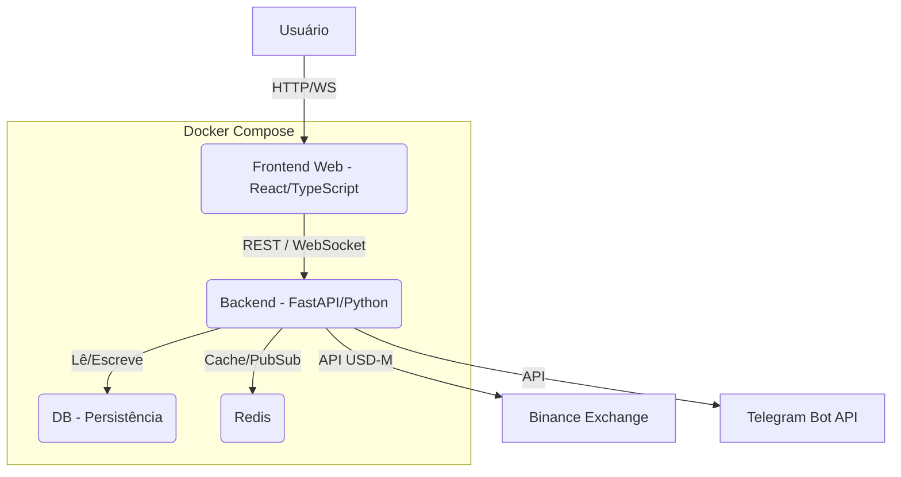

# Arquitetura do Projeto Crypto Trading Bot (Atualizado 2025-11-11)

Este documento detalha a arquitetura do sistema Crypto Trading Bot, descrevendo seus componentes principais, fluxos, decisões recentes (P1/P2/P3), análise técnica detalhada por módulo, lacunas conhecidas e recomendações acionáveis. Esta versão está alinhada ao README.md e à API SPEC atualizadas.

## Visão Geral da Arquitetura

O bot é um sistema distribuído orquestrado via Docker Compose. Componentes principais:
- Backend: FastAPI (Python) assíncrono, módulos de estratégia/execução/risco/monitoramento.
- Frontend: React + TypeScript (Vite) para painel e operação.
- Banco de dados: PostgreSQL.
- Mensageria/Cache: Redis.
- Integrações: Binance (USD‑M Futures), Telegram.

## Estrutura de Diretórios (alto nível)

- backend/
  - api/ (endpoints, app FastAPI, websocket)
  - config/ (Pydantic Settings)
  - models/ (DB)
  - modules/ (estratégia, execução, risco, monitor etc.)
  - utils/ (binance client, logger, telegram)
- database/ (migrations, seeds)
- docs/ (documentação)
- frontend/ (painel)
- logs/ (arquivos de log)
- docker-compose.yml

## Fluxos Principais

1) Scan → Sinais → Filtros → Risco → Execução → Monitoramento
- market_scanner.scan_market(): coleta universo (klines 1h/4h).
- signal_generator.generate_signal(): computa indicadores, regime, momentum, DER (funding/OI/taker) e score; calcula SL/TP/lever.
- correlation_filter.filter_correlated_signals(): remove ativos altamente correlacionados (janela 14d, |corr|>0.5).
- market_filter.should_trade_symbol(): bloqueios contextuais (pump/dump, regime BTC, fim de semana).
- risk_manager.validate_trade(): valida risco por trade e risco total.
- order_executor: envia ordens (LIMIT com re-quote; fallback MARKET), pós-checagem de headroom.
- position_monitor: acompanha posições, aplica trailing/partials/emergency/kill-switch, notifica via Telegram.

2) Operação e Supervisão
- autonomous_bot: orquestra ciclo contínuo (scan, gerar sinais, filtrar, executar).
- supervisor.py (externo): watchdog que mantém API saudável e bot rodando; integra com logs/flag.

3) Painel Web
- Dashboard: saúde, status do bot, KPIs diários.
- Config Bot: leitura de settings (subset) e ajustes de runtime do bot.
- Supervisor: status/controles quando expostos.

## Análise Detalhada por Módulo

### market_scanner.py
- Obtém exchange_info e tickers; filtra pares USDT em TRADING; ordena top por quoteVolume e corta para ~60; whitelist rígida em testnet; coleta klines 1h/4h (200).
- Pontos fortes:
  - Simples e robusto; evita símbolos inválidos no testnet via verificação de preço.
- Gaps e riscos:
  - Não consome SCANNER_TOP_N/SCANNER_MAX_SYMBOLS de settings.
  - Não filtra por contractType PERPETUAL (pode incluir contratos indesejados).
  - Semáforo/concurrency ausente (risco rate-limit).
  - Falta limiar de liquidez mínima (MIN_QUOTE_VOLUME_USDT_24H).
- Recomendações:
  - Ler parâmetros do settings e filtrar PERPETUAL + TRADING.
  - Introduzir asyncio.Semaphore (ex.: 8–10) para klines.
  - Aplicar MIN_QUOTE_VOLUME_USDT_24H e blacklist de estáveis irrelevantes.
  - Homologar TESTNET_WHITELIST em settings.

### signal_generator.py
- Parâmetros permissivos para testnet (min_score=0, threshold volume 0.0, RSI 80/20, sem confirmação multi-TF, sem momentum mínimo).
- Indicadores: EMA50/200, RSI(14), ATR; regime simples (slope EMA200 + ATR%); RR checado; funding-aware integrado (ajustes por OI/taker/funding e janela de bloqueio).
- Pontos fortes:
  - Pipeline amplo (técnicos + derivativos), R:R checado, alavancagem dinâmica.
- Gaps:
  - Preset PROD não aplicado; números “mágicos” hardcoded.
- Recomendações:
  - Ler presets do settings por ambiente (testnet/prod).
  - PROD: min_score 70; volume_threshold 0.5; RSI 30/70; require_trend_confirmation True; min_momentum_threshold 0.2%; RR_MIN_TREND 1.2; RR_MIN_RANGE 1.6.
  - TESTNET: valores mais permissivos, porém não triviais (ex.: min_score ≥ 40; RSI 25/75; volume_threshold ≥ 0.2).

### correlation_filter.py
- Janela 14d (1d klines), threshold 0.5; cache 1h; verificação contra posições abertas e sinais já aceitos.
- Pontos fortes:
  - Simples, funcional e com cache.
- Recomendações:
  - Parametrizar via settings (CORR_WINDOW_DAYS, MAX_CORRELATION).
  - Estratégia de seleção greedy para maximizar diversidade (ordenar por score, aceitar apenas se |corr|≤ threshold com todos selecionados).

### market_filter.py
- Pump/dump: rejeita |Δ|>30% em 2h sem volume sustentado (≥2x).
- Ajustes por fim de semana (score mínimo 75) e gating por regime BTC (UP/DOWN/STRONG).
- Recomendações:
  - Parametrizar thresholds no settings (PUMP/DUMP_* e REQUIRED_SCORE_SIDEWAYS).
  - Adicionar “dump” explícito com os mesmos critérios.
  - Ajustar score mínimo por regime (sideways mais exigente).

### risk_manager.py
- Define 3% por trade e 60% total (agressivo); tracking de wins/losses altera risco base; calcula métricas de portfólio.
- Gaps:
  - Desalinhado do settings (RISK_PER_TRADE=0.02; MAX_PORTFOLIO_RISK=0.15).
- Recomendações:
  - Ler RISK_PER_TRADE/MAX_PORTFOLIO_RISK do settings; respeitar MAX_POSITIONS.
  - (Opcional) Daily Max Loss (ex.: 5%) e Intraday Hard Stop (ex.: 8%) com Redis para contadores.

### order_executor.py
- P1 Execução: LIMIT com buffer e re-quote (até 3 tentativas), maker post-only (manual/auto por spread); fallback MARKET com cálculo do preço médio via fills; validações de filtros (step/minNotional).
- Pós-abertura: checa headroom (liquidationPrice) e reduz posição por etapas até HEADROOM_MIN_PCT.
- Pontos fortes:
  - Boas práticas para minimizar slippage e evitar entradas inseguras.
- Recomendações:
  - Manter logs estruturados com métricas de execução (tentativas, maker/taker, tempo por ordem).

### position_monitor.py
- Gestão ativa: trailing/breakeven/partials/drawdown kill-switch/circuit-breaker/blacklist por símbolo; notificações Telegram ricas.
- Recomendações:
  - TSL callback adaptativo por ATR (min/max via settings).
  - Métricas por evento (tempo em posição, MAE/MFE quando possível).

### autonomous_bot.py
- Orquestra ciclo (scan → gerar → filtrar → executar), respeitando min_score, max_positions e scan_interval.
- Recomendações:
  - Registrar KPIs por ciclo (sinais gerados/aceitos/rejeitados por filtro, latências).

### utils/binance_client.py
- Envolve chamadas futures_* com lógica robusta; recomendado backoff com jitter e códigos de erro específicos da Binance.
- Recomendações:
  - Centralizar `_retry_call` com política configurável (max_attempts, base_delay, multiplicador).

## Configurações (Pydantic Settings) e Mapeamento

Arquivo: backend/config/settings.py
- Já inclui chaves críticas: execução, risco, derivativos, scanner, bot, sync, telegram.
- Recomendações de novas chaves:
  - Scanner: MIN_QUOTE_VOLUME_USDT_24H (float), SCANNER_CONCURRENCY (int), TESTNET_WHITELIST (list[str])
  - Sinais: PROD_MIN_SCORE, PROD_VOLUME_THRESHOLD, PROD_RSI_OVERSOLD/OVERBOUGHT, REQUIRE_TREND_CONFIRMATION, MIN_MOMENTUM_THRESHOLD_PCT, RR_MIN_TREND/RANGE
  - Correlação: CORR_WINDOW_DAYS, MAX_CORRELATION
  - Mercado: PUMP/DUMP_THRESHOLD_PCT, *_TIMEFRAME_HOURS, *_MIN_SUSTAINED_VOLUME_X, REQUIRED_SCORE_SIDEWAYS
  - Risco: DAILY_MAX_LOSS_PCT, INTRADAY_DRAWDOWN_HARD_STOP_PCT

Mapeamento sugerido:
- market_scanner ← SCANNER_TOP_N, SCANNER_MAX_SYMBOLS, MIN_QUOTE_VOLUME_USDT_24H, SCANNER_CONCURRENCY, TESTNET_WHITELIST/STRICT
- signal_generator ← PROD_* e thresholds de RR/momentum/confirm_trend (alternando por BINANCE_TESTNET)
- correlation_filter ← CORR_WINDOW_DAYS, MAX_CORRELATION
- market_filter ← PUMP/DUMP_* e REQUIRED_SCORE_SIDEWAYS
- risk_manager ← RISK_PER_TRADE, MAX_PORTFOLIO_RISK, DAILY_MAX_LOSS_PCT, INTRADAY_DRAWDOWN_*

## Observabilidade e Métricas

- Health: GET /health (checks db/redis/binance/supervisor)
- Logs: /api/system/logs (tail por componente)
- Métricas desejáveis:
  - Scanner: symbols avaliados/aceitos, latência total e média por símbolo, taxa de erro de klines.
  - Sinais: distribuição de score, aprovações por filtro, R:R médio aceito.
  - Execução: tentativas LIMIT, % maker vs taker, tempo por ordem, slippage estimado.
  - Monitor: nº eventos trailing/partials/SL/ES, tempo médio em trade.
  - Risco: exposição total/pico, bloqueios por risco/daily cap.
- Telegram: eventos principais já notificados.

## P1/P2/P3 — Decisões e Justificativas

- P1 Execução: robustez vs. slippage (post-only quando viável, re-quote, fallback seguro).
- P1 Risco: headroom mínimo pós-abertura reduz risco de liquidação prematura.
- P2 Custos: preparar decisões custo‑ótimas com awareness de comissões.
- P3 Estratégia: regime de mercado influencia R:R, melhora seleção sob volatilidade e tendência.

## Frontend (painel)

- Páginas: Dashboard, Config Bot, Supervisor.
- Serviços API (axios) com fallback para proxy do Vite; timeout e retry leves.
- Roadmap: Sinais/Backtest/Trades detalhados/WebSocket.
- Integração: expõe /api/config/ (somente leitura), toggles de execução e controles de bot.

## Segurança e Operação

- Testnet por padrão (BINANCE_TESTNET=True).
- Não comitar chaves reais; avaliar autenticação para ambientes expostos.
- Supervisor recomendado para sessões longas e resiliência.
- Runbook e exemplos em docs/DEPLOYMENT.md.

## Gaps e Riscos Prioritários

1) Desalinhamento de RiskManager com settings (3%/60% vs 2%/15%).
2) Scanner sem parametrização de universo/concorrência/liquidez mínima.
3) SignalGenerator sem preset PROD e thresholds centralizados.
4) Falta de métricas estruturadas de pipeline (observabilidade).
5) Market/Correlation Filter com thresholds hardcoded (devem migrar para settings).

## Recomendações Implementáveis (ordem sugerida)

1) Alinhar RiskManager a settings e respeitar MAX_POSITIONS.
2) Parametrizar SignalGenerator por ambiente (testnet/prod) a partir do settings.
3) Ajustar MarketScanner para consumir SCANNER_* e aplicar filtros PERPETUAL + liquidez mínima + semáforo.
4) Expor thresholds de Market/Correlation Filter via settings e adicionar seleção greedy diversificada.
5) TSL adaptativo por ATR e RR mínimo por regime via settings.

## Endpoints Relevantes (referência)

- Ver docs/API_SPEC.md para lista completa (inclui /api/config/).
- Health/Version, Trading (execução/sinais/posições/bot), Execução (runtime), Admin (force‑many), System (logs, userstream, supervisor).
